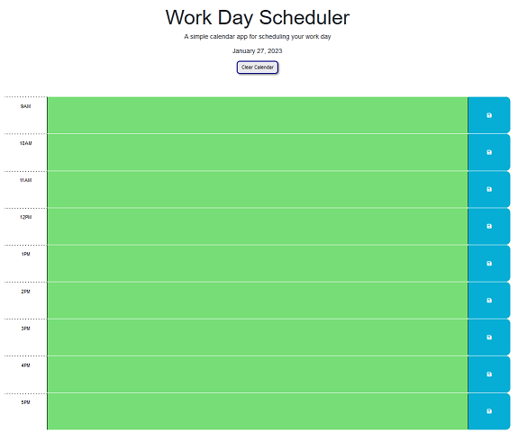

# time-check

## Description

This is a class assignment focused on applying styles based on the current time vs. calendar time blocks.  We were also tasked with demonstrating knowledge of localStorage by making the data persist.

- GIVEN I am using a daily planner to create a schedule

- WHEN I open the planner, THEN the current day is displayed at the top of the calendar
- WHEN I scroll down, THEN I am presented with time blocks for standard business hours
- WHEN I view the time blocks for that day, THEN each time block is color-coded to indicate whether it is in the past, present, or future
- WHEN I click into a time block, THEN I can enter an event
- WHEN I click the save button for that time block, THEN the text for that event is saved in local storage
- WHEN I refresh the page, THEN the saved events persist

## Table of Contents

- [Installation](#installation)
- [Usage](#usage)
- [Credits](#credits)
- [License](#license)

## Installation

Runs in the browser for mobile, tablet, laptop, and PC devices.

## Usage

You can visit the live application at - https://maximusDecimalusMeridius.github.io/time-check

## Credits
This favicon was generated using the following graphics from Twitter Twemoji:

- Graphics Title: 1f4ac.svg
- Graphics Author: Copyright 2020 Twitter, Inc and other contributors (https://github.com/twitter/twemoji)
- Graphics Source: https://github.com/twitter/twemoji/blob/master/assets/svg/1f4ac.svg
- Graphics License: CC-BY 4.0 (https://creativecommons.org/licenses/by/4.0/)

## License

MIT License - Please refer to the LICENSE in the repo.